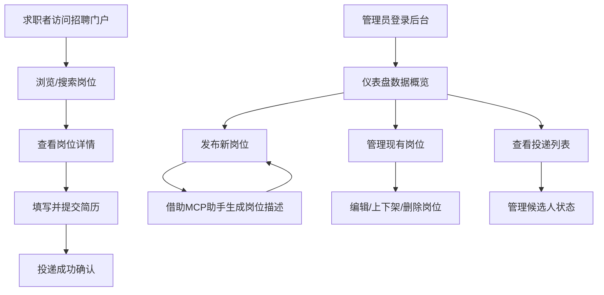

# 五新重工招聘网站 - 产品需求文档

## 1. 产品概述

五新重工招聘网站是一个面向制造业人才的企业招聘平台，包含前台招聘门户和管理后台，支持岗位发布、简历投递、人才管理及 MCP（Model Context Protocol）智能助手能力。
- 目标用户：求职者（浏览岗位、投递简历）、招聘管理员（发布/管理岗位、查看投递）
- 产品价值：通过现代化招聘平台提升五新重工的人才获取效率，借助 AI 能力优化招聘全流程

## 2. 核心功能

### 2.1 用户角色

| 角色 | 访问方式 | 核心权限 |
|------|----------|----------|
| 求职者 | 直接访问招聘门户 | 浏览岗位、查看岗位详情、投递简历 |
| 招聘管理员 | 登录管理后台 | 发布岗位、编辑/下架岗位、查看投递列表、管理候选人 |

### 2.2 功能模块

1. **招聘门户首页**：企业介绍 Banner、热门岗位展示、搜索筛选、企业优势展示
2. **岗位列表页**：按类别/地点/关键词筛选、分页展示所有岗位
3. **岗位详情页**：岗位描述、任职要求、薪资福利、投递入口
4. **简历投递**：在线填写并投递简历（姓名、联系方式、工作经历、教育经历）
5. **管理员登录**：安全认证进入管理后台
6. **岗位管理**：发布新岗位、编辑、上下架、删除
7. **投递管理**：查看各岗位投递列表、管理候选人状态
8. **MCP 智能助手**：基于 MCP 协议的 AI 功能（岗位描述生成、简历匹配分析）

### 2.3 页面详情

| 页面名称 | 模块名称 | 功能描述 |
|----------|----------|----------|
| 招聘门户首页 | 导航栏 | 品牌 Logo、导航链接、管理入口 |
| 招聘门户首页 | Hero Banner | 企业宣传大图、标语、快速搜索入口 |
| 招聘门户首页 | 热门岗位 | 展示 4-6 个精选热门岗位卡片 |
| 招聘门户首页 | 企业优势 | 企业实力、文化、福利的优势展示区 |
| 招聘门户首页 | 页脚 | 联系方式、版权信息、友情链接 |
| 岗位列表页 | 筛选区 | 关键词搜索、类别筛选、地点筛选 |
| 岗位列表页 | 岗位列表 | 岗位卡片列表，包含岗位名称、部门、地点、薪资 |
| 岗位详情页 | 岗位信息 | 完整岗位描述、要求、福利待遇 |
| 岗位详情页 | 投递表单 | 简历投递表单（姓名、电话、邮箱、简历上传或在线填写） |
| 管理后台 | 登录页 | 管理员登录表单 |
| 管理后台 | 仪表盘 | 数据概览：岗位总数、投递总数、最新投递 |
| 管理后台 | 岗位管理 | 岗位列表管理，支持发布/编辑/上下架/删除 |
| 管理后台 | 发布岗位 | 带富文本编辑器的新岗位发布表单 |
| 管理后台 | 投递管理 | 按岗位查看投递候选人列表，管理候选人状态 |
| 管理后台 | MCP 助手面板 | 调用 MCP 工具的 AI 辅助功能 |

## 3. 核心流程

首先用户可浏览招聘门户查看岗位并投递简历；管理员登录后台管理岗位与投递，并可借助 MCP 助手优化岗位描述。

## 4. 用户界面设计

### 4.1 设计风格

- **主色调**：深蓝灰 `#1a2332`（稳重、工业感）、辅以亮橙 `#f97316` 作为强调色（活力、行动号召）
- **背景色**：浅灰 `#f8f9fa` 到白渐变，深色区域用 `#0f172a`
- **字体**：标题使用 "Noto Sans SC"（思源黑体），正文使用 "Noto Sans SC" 细体
- **按钮风格**：直角按钮，粗体、hover 有微提升效果，强调色按钮用橙色渐变
- **布局风格**：上下布局，顶部导航固定在视口上方，内容区域宽屏居中
- **图标风格**：简洁线性图标，与工业风格协调
- **设计理念**：重工业质感 + 现代简洁

### 4.2 页面设计概览

| 页面名称 | 模块名称 | UI 元素 |
|----------|----------|----------|
| 招聘门户首页 | Hero Banner | 全宽深色背景、大字标题、渐变装饰光效、搜索栏 |
| 招聘门户首页 | 热门岗位 | 4 列网格卡片，每张卡片含图标/岗位名/部门/地点/薪资/标签 |
| 岗位列表页 | 筛选区 | 水平筛选栏，搜索框+下拉选择器+筛选按钮 |
| 岗位详情页 | 投递表单 | 分栏布局，左侧岗位信息，右侧固定投递表单卡片 |
| 管理后台 | 侧边栏 | 深色侧边导航，图标+文字菜单项 |
| 管理后台 | 仪表盘 | 统计卡片网格：岗位总数、投递总数、本月新增 |
| 管理后台 | 发布岗位 | 表单含字段：岗位名称、部门、工作地点、薪资范围、职责(富文本)、要求(富文本) |
| MCP 助手 | 助手面板 | 侧边弹出面板，对话式交互，可调用 AI 生成岗位描述 |

### 4.3 响应式设计

- 优先桌面端设计（招聘后台主要面向 PC 管理员）
- 前台门户支持平板和手机端自适应
- 后台管理仅桌面端完整展示

## 5. 技术整合

### 5.1 MCP 集成

MCP（Model Context Protocol）集成方案：

**MCP Tools（工具）：**
- `generate_job_description`：根据岗位名称和要求，AI 生成完整的岗位描述文本
- `analyze_resume_match`：分析简历与岗位的匹配度

**MCP Resources（资源）：**
- `job-posting://{id}`：岗位发布数据的标准化资源访问
- `candidate://{id}`：候选人数据的标准化资源访问

**使用场景：**
1. 管理员发布岗位时，填写基本信息后调用 MCP 工具生成完整岗位描述
2. 管理员查看候选人时，调用 MCP 工具分析简历匹配度
