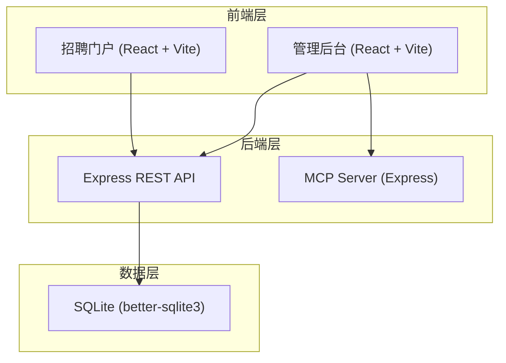
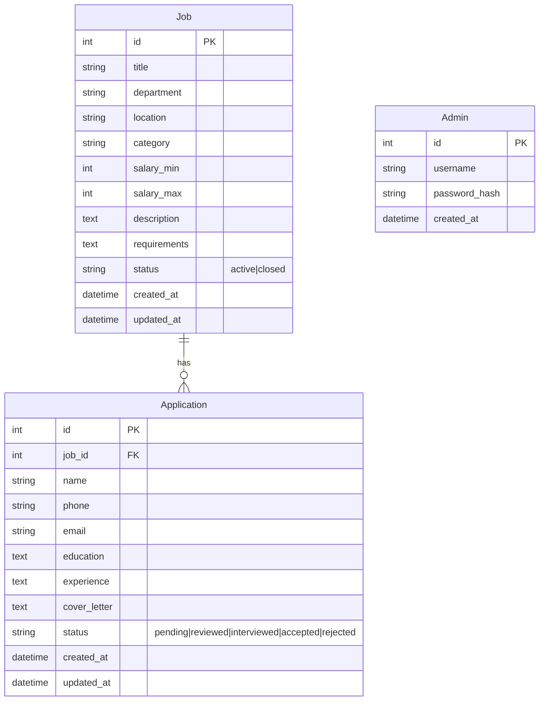
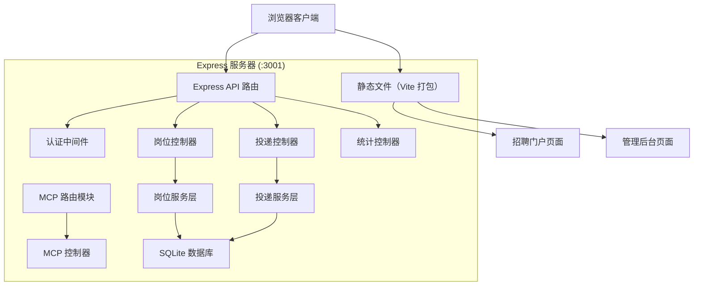

# 五新重工招聘网站 - 技术架构文档

## 1. 架构设计



## 2. 技术说明

- **前端**：React@18 + React Router@6 + TailwindCSS@3 + Vite
- **初始化工具**：Vite (React 模板)
- **后端**：Express@4 (同时作为 REST API 和 MCP Server)
- **数据库**：SQLite (better-sqlite3)，使用 mock 初始数据
- **富文本编辑器**：react-quill@2
- **HTTP 客户端**：fetch (内置)
- **认证方式**：简单 Session/Cookie 认证（管理后台）

## 3. 路由定义

### 前台招聘门户

| 路由 | 用途 |
|------|------|
| / | 招聘门户首页：Hero、热门岗位、企业优势 |
| /jobs | 岗位列表页：搜索、筛选、分页 |
| /jobs/:id | 岗位详情页 + 投递表单 |

### 管理后台

| 路由 | 用途 |
|------|------|
| /admin/login | 管理员登录 |
| /admin | 管理仪表盘：数据概览 |
| /admin/jobs | 岗位管理列表 |
| /admin/jobs/new | 发布新岗位 |
| /admin/jobs/:id/edit | 编辑岗位 |
| /admin/applications | 投递管理列表 |

## 4. API 定义

### 岗位管理接口

```typescript
// 获取岗位列表
GET /api/jobs?search=&category=&location=&page=&limit=
Response: { jobs: Job[], total: number, page: number, limit: number }

// 获取岗位详情
GET /api/jobs/:id
Response: { job: Job }

// 创建岗位（需要管理员认证）
POST /api/jobs
Request: { title, department, location, category, salaryMin, salaryMax, description, requirements, status }
Response: { job: Job }

// 更新岗位
PUT /api/jobs/:id
Request: { title?, department?, ... }
Response: { job: Job }

// 删除岗位
DELETE /api/jobs/:id
Response: { success: true }

// 切换岗位上下架状态
PATCH /api/jobs/:id/status
Request: { status: 'active' | 'closed' }
Response: { job: Job }
```

### 投递管理接口

```typescript
// 投递简历
POST /api/applications
Request: { jobId, name, phone, email, education, experience, coverLetter }
Response: { application: Application }

// 获取岗位投递列表（管理员）
GET /api/applications?jobId=&page=&limit=
Response: { applications: Application[], total: number }

// 更新投递状态
PATCH /api/applications/:id/status
Request: { status: 'pending' | 'reviewed' | 'interviewed' | 'accepted' | 'rejected' }
Response: { application: Application }
```

### 认证接口

```typescript
// 管理员登录
POST /api/auth/login
Request: { username, password }
Response: { token, admin: { username } }

// 验证登录状态
GET /api/auth/me
Response: { admin: { username } }

// 退出登录
POST /api/auth/logout
Response: { success: true }
```

### 仪表盘统计

```typescript
// 获取统计数据
GET /api/stats/dashboard
Response: { totalJobs, totalApplications, recentApplications, applicationsByStatus }
```

### MCP 接口

```typescript
// 调用 MCP 工具
POST /api/mcp/tool
Request: { tool: string, args: object }
Response: { result: any }

// 可用工具：
// tool: "generate_job_description"
// args: { title: string, requirements: string, department: string }
// response: { description: string, requirements: string }
//
// tool: "analyze_resume_match"
// args: { jobId: number, applicationId: number }
// response: { matchScore: number, analysis: string, highlights: string[] }

// 获取 MCP 资源
GET /api/mcp/resource/:type/:id
Response: { resource: object }
// type: "job" | "candidate"
```

## 5. 数据模型

### 5.1 ER 图



### 5.2 数据定义语言

```sql
CREATE TABLE jobs (
    id INTEGER PRIMARY KEY AUTOINCREMENT,
    title TEXT NOT NULL,
    department TEXT NOT NULL,
    location TEXT NOT NULL DEFAULT '北京',
    category TEXT NOT NULL DEFAULT '技术',
    salary_min INTEGER,
    salary_max INTEGER,
    description TEXT DEFAULT '',
    requirements TEXT DEFAULT '',
    status TEXT NOT NULL DEFAULT 'active' CHECK(status IN ('active', 'closed')),
    created_at DATETIME DEFAULT CURRENT_TIMESTAMP,
    updated_at DATETIME DEFAULT CURRENT_TIMESTAMP
);

CREATE TABLE applications (
    id INTEGER PRIMARY KEY AUTOINCREMENT,
    job_id INTEGER NOT NULL,
    name TEXT NOT NULL,
    phone TEXT NOT NULL,
    email TEXT NOT NULL,
    education TEXT DEFAULT '',
    experience TEXT DEFAULT '',
    cover_letter TEXT DEFAULT '',
    status TEXT NOT NULL DEFAULT 'pending' CHECK(status IN ('pending', 'reviewed', 'interviewed', 'accepted', 'rejected')),
    created_at DATETIME DEFAULT CURRENT_TIMESTAMP,
    updated_at DATETIME DEFAULT CURRENT_TIMESTAMP,
    FOREIGN KEY (job_id) REFERENCES jobs(id)
);

CREATE TABLE admins (
    id INTEGER PRIMARY KEY AUTOINCREMENT,
    username TEXT NOT NULL UNIQUE,
    password_hash TEXT NOT NULL,
    created_at DATETIME DEFAULT CURRENT_TIMESTAMP
);

-- 初始管理员账号 (admin / admin123)
INSERT INTO admins (username, password_hash) VALUES ('admin', '8c6976e5b5410415bde908bd4dee15dfb167a9c873fc4bb8a81f6f2ab448a918');

-- 初始岗位数据
INSERT INTO jobs (title, department, location, category, salary_min, salary_max, description, requirements, status) VALUES
('高级机械工程师', '研发部', '北京', '技术', 25000, 40000, '负责重型机械产品的设计与研发工作，参与新产品开发全流程，包括方案设计、详细设计、样机测试等。', '1. 机械工程及相关专业本科以上学历\n2. 8年以上重型机械设计经验\n3. 熟练使用SolidWorks、AutoCAD等设计软件\n4. 有大型工程项目经验者优先', 'active'),
('电气工程师', '电气部', '北京', '技术', 20000, 35000, '负责重型机械设备电气系统的设计与调试，PLC编程，电气原理图绘制。', '1. 电气工程或自动化相关专业本科及以上\n2. 5年以上电气设计经验\n3. 熟悉西门子、三菱等PLC编程\n4. 能适应短期出差', 'active'),
('焊接工艺工程师', '工艺部', '唐山', '技术', 15000, 25000, '负责焊接工艺方案的制定与优化，焊接质量控制，焊接工艺评定。', '1. 材料成型或焊接相关专业\n2. 3年以上焊接工艺经验\n3. 持有IWE或CWI证书者优先\n4. 熟悉ISO焊接标准', 'active'),
('项目经理', '项目部', '北京', '管理', 20000, 35000, '负责重工项目的全流程管理，包括项目计划、进度控制、资源协调、风险管理等。', '1. 工程管理或相关专业本科以上\n2. 5年以上项目管理经验\n3. 持有PMP证书者优先\n4. 具有良好的沟通协调能力', 'active'),
('质量检验员', '质量部', '唐山', '技术', 10000, 18000, '负责原材料、半成品和成品的质量检验工作，编制质检报告，参与质量改进。', '1. 机械或材料相关专业大专以上\n2. 2年以上质检经验\n3. 熟悉各类量具和检测设备\n4. 工作认真负责', 'active'),
('液压系统设计师', '研发部', '北京', '技术', 22000, 38000, '负责重型机械液压系统的设计与计算，液压原理图绘制，液压元件选型。', '1. 液压或机械相关专业硕士以上\n2. 5年以上液压系统设计经验\n3. 熟练使用AMESim等仿真软件\n4. 有工程机械液压系统设计经验者优先', 'active');
```

## 6. 服务器架构图


